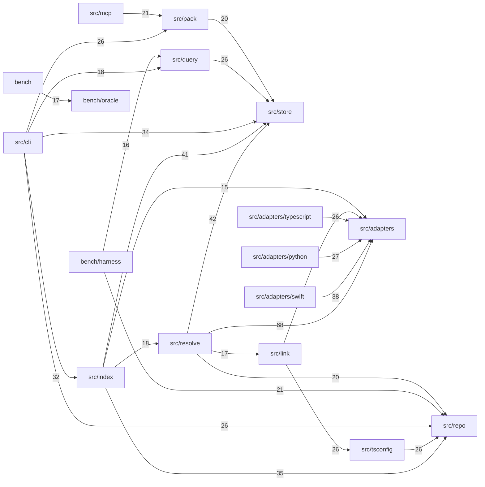

# Architecture

<!-- generated by sonde doc; edits will be overwritten -->

Describes commit 9499a105bd45e2dd57adcab1c6977c6758061e4a plus uncommitted changes.

28 all-test module(s) were excluded. Run `sonde doc --include-tests` to include them.

Cross-module references by how they were resolved: COMPILER 719, LEXICAL 283, HEURISTIC 1813.

`HEURISTIC` means the target was inferred from a name rather than resolved. Dependencies supported only by heuristic references are drawn with dashed arrows and should be read as likely, not certain.

## Module dependencies

228 lower-weight dependency pair(s) are not shown in the diagram; the table below is complete.

| From | To | References | Evidence |
|---|---|---:|---|
| `src/resolve` | `src/adapters` | 70 | COMPILER 65, LEXICAL 3, HEURISTIC 2 |
| `src/resolve` | `src/store` | 50 | COMPILER 37, LEXICAL 5, HEURISTIC 8 |
| `src/index` | `src/store` | 43 | COMPILER 36, LEXICAL 5, HEURISTIC 2 |
| `src/adapters/swift` | `src/adapters` | 41 | COMPILER 33, LEXICAL 5, HEURISTIC 3 |
| `src/index` | `src/repo` | 35 | COMPILER 24, LEXICAL 11 |
| `src/cli` | `src/store` | 46 | COMPILER 28, LEXICAL 6, HEURISTIC 12 |
| `src/cli` | `src/index` | 35 | COMPILER 29, LEXICAL 3, HEURISTIC 3 |
| `src/adapters/python` | `src/adapters` | 30 | COMPILER 22, LEXICAL 5, HEURISTIC 3 |
| `src/query` | `src/store` | 42 | COMPILER 18, LEXICAL 8, HEURISTIC 16 |
| `src/cli` | `src/pack` | 35 | COMPILER 22, LEXICAL 4, HEURISTIC 9 |
| `src/tsconfig` | `src/repo` | 35 | COMPILER 24, LEXICAL 2, HEURISTIC 9 |
| `src/adapters/typescript` | `src/adapters` | 27 | COMPILER 21, LEXICAL 5, HEURISTIC 1 |
| `src/cli` | `src/repo` | 26 | COMPILER 17, LEXICAL 9 |
| `src/link` | `src/tsconfig` | 26 | COMPILER 19, LEXICAL 7 |
| `src/mcp` | `src/pack` | 30 | COMPILER 17, LEXICAL 4, HEURISTIC 9 |
| `bench/harness` | `src/repo` | 26 | COMPILER 15, LEXICAL 6, HEURISTIC 5 |
| `src/pack` | `src/store` | 29 | COMPILER 13, LEXICAL 7, HEURISTIC 9 |
| `src/resolve` | `src/repo` | 26 | COMPILER 13, LEXICAL 7, HEURISTIC 6 |
| `src/index` | `src/resolve` | 22 | COMPILER 15, LEXICAL 3, HEURISTIC 4 |
| `src/cli` | `src/query` | 18 | COMPILER 16, LEXICAL 2 |
| `src/resolve` | `src/link` | 26 | COMPILER 12, LEXICAL 5, HEURISTIC 9 |
| `bench` | `bench/oracle` | 18 | COMPILER 15, LEXICAL 2, HEURISTIC 1 |
| `bench/harness` | `src/query` | 21 | COMPILER 12, LEXICAL 4, HEURISTIC 5 |
| `src/link` | `src/adapters` | 19 | COMPILER 14, LEXICAL 2, HEURISTIC 3 |
| `src/index` | `src/adapters` | 16 | COMPILER 12, LEXICAL 3, HEURISTIC 1 |
| `src/link` | `src/repo` | 16 | COMPILER 10, LEXICAL 4, HEURISTIC 2 |
| `src/pack` | `src/repo` | 14 | COMPILER 8, LEXICAL 6 |
| `src/pack` | `src/index` | 13 | COMPILER 11, LEXICAL 2 |
| `src/pack` | `src/query` | 14 | COMPILER 11, LEXICAL 1, HEURISTIC 2 |
| `src/doc` | `src/repo` | 13 | COMPILER 10, LEXICAL 2, HEURISTIC 1 |

65 lighter dependencies are not listed. Run `sonde doc --module <path>` for a module's complete set.
158 further module pair(s) share symbol names but have no resolved reference between them. They are not shown: a shared name is a coincidence, not a dependency, and modules with parallel structure produce the most of them.

## Modules

| Module | Files | Symbols | Used by other modules |
|---|---:|---:|---|
| `.` | 1 | 1 | — |
| `bench` | 1 | 20 | — |
| `bench/harness` | 12 | 304 | `fixtureRoot`, `payload` |
| `bench/oracle` | 4 | 62 | `byKind`, `compare`, `precision`, `recall`, `KindScore`, `OracleEdge`, +6 more |
| `probes/python-placement` | 2 | 57 | — |
| `probes/swift-narrowing` | 1 | 56 | — |
| `src` | 1 | 6 | `EXTRACTOR_VERSION`, `SCHEMA_VERSION`, `PACKAGE_VERSION` |
| `src/adapters` | 3 | 67 | `SymbolRecord`, `ReferenceRecord`, `ImportRecord`, `name`, `ExportRecord`, `stableKey`, +36 more |
| `src/adapters/python` | 6 | 100 | `params`, `getPythonParser`, `extractPythonSymbols`, `pythonParser`, `PYTHON_STDLIB_MODULES`, `extractPythonReferences`, +1 more |
| `src/adapters/swift` | 6 | 129 | `SWIFT_SDK_SYMBOLS`, `getSwiftParser`, `callable`, `extractSwiftModuleTables`, `extractSwiftReferences`, `extractSwiftSymbols`, +3 more |
| `src/adapters/typescript` | 5 | 122 | `getTsParser`, `identifier`, `stableKey`, `typescriptAdapter` |
| `src/cli` | 3 | 126 | — |
| `src/doc` | 3 | 135 | `structuralBody`, `DOC_PATH`, `NoDocumentableModulesError`, `action`, `generateDoc`, `renderModuleDetail`, +1 more |
| `src/enrich` | 3 | 51 | `EMBEDDING_MODEL`, `buildSymbolDocument`, `embed`, `hashInput`, `left`, `loadEmbedder`, +2 more |
| `src/index` | 3 | 68 | `indexPathFor`, `indexRepo`, `checkDrift`, `driftCount`, `AUTO_REFRESH_LIMIT`, `filesIndexed`, +11 more |
| `src/link` | 4 | 53 | `Binding`, `resolveForFile`, `bindImports`, `buildExportMap`, `external`, `name`, +5 more |
| `src/mcp` | 2 | 25 | `createServer` |
| `src/pack` | 5 | 119 | `buildEnvelope`, `db`, `estimateJsonTokens`, `ensureFresh`, `estimateTokens`, `freshness`, +11 more |
| `src/query` | 4 | 183 | `stableKey`, `affected`, `compiler`, `heuristic`, `lexical`, `findSymbols`, +14 more |
| `src/repo` | 4 | 80 | `RepoBoundary`, `readFile`, `path`, `resolve`, `discover`, `root`, +14 more |
| `src/resolve` | 9 | 367 | `assignTier`, `narrowCandidates`, `edges`, `external`, `implemented`, `reject`, +13 more |
| `src/store` | 4 | 182 | `Store`, `Db`, `SymbolKind`, `migrate`, `openDb`, `EdgeKind`, +53 more |
| `src/tsconfig` | 2 | 82 | `TsConfig`, `path`, `Resolution`, `kind`, `resolveSpecifier`, `loadTsConfig`, +1 more |
| `tests/fixtures/ts` | 1 | 7 | — |

Symbol-level detail is not committed, because it changes on every edit. Run `sonde doc --module <path>` for it.
